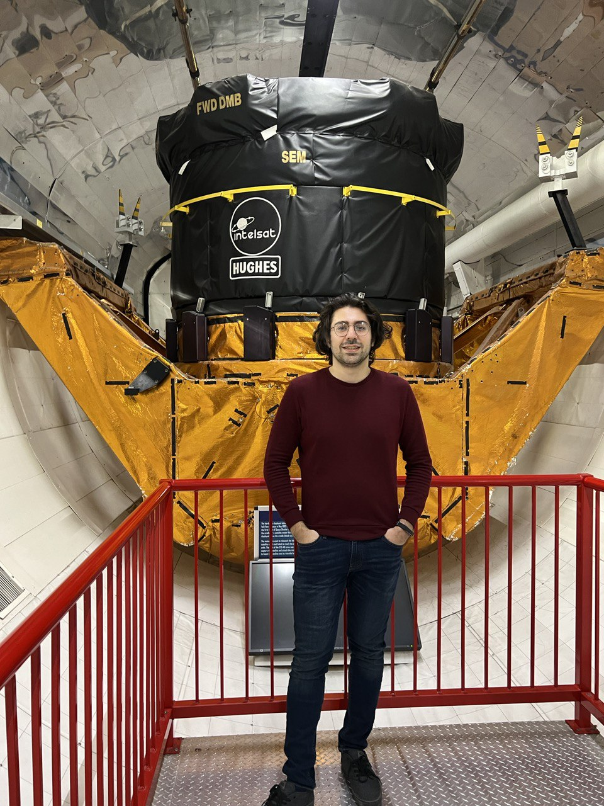

<left> <h1>Alireza Pedram
  <!-- Google tag (gtag.js) -->

</h1> </left>

I am a Ph.D. candidate in the Walker Department of Mechanical Engineering at the University of Texas at Austin.
The goal of my research is to develop theoretical and computational methods to <b>reduce the computation and communication loads in the decision-making process of autonomous agents</b>.
In the future information-rich autonomy, agents will have to be able to process a huge amount of information in an online manner with  bounded
perceptual/communicational resources.
I aim to develop <b>frameworks helping autonomous agents strategically analyze/communicate a small portion of available information without compromising performance or safety</b>.   
In doing so, I employ different tools from diverse fields, such as motion planning, stochastic optimal control theory, information theory, and optimization. To demonstrate the utility of  proposed frameworks, I also test and evaluate the performance of the designed 
systems through numerical simulations and hardware experiments. 
Some applications of my research include enabling online decision-making and agile maneuvering in mobile robotics (like micro-aerial vehicles) and mitigating communication load in large-scale networks such as fleets of autonomous vehicles.

<!--

y research aims to build <b>socially intelligent autonomous systems</b> that co-exist, cooperate, and compete with other agents, as well as with humans.
  
-->
